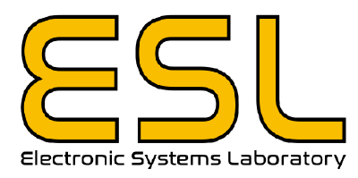
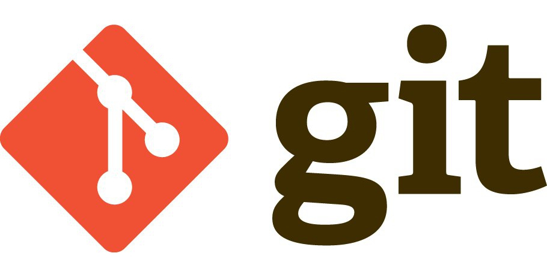
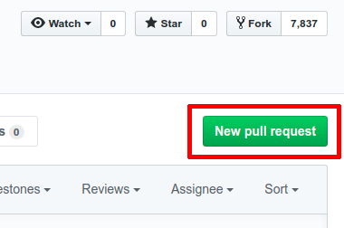
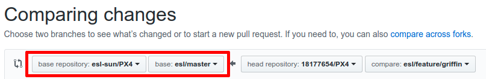
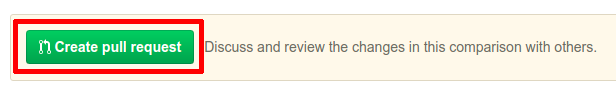

# ESL Git Workflow Guide

 

This document describes the ESL git workflow for its Github account, along with examples to demonstrate the workflow.

If you are new to git, please watch the following video:

[](http://www.youtube.com/watch?v=HVsySz-h9r4)

The ESL git workflow is based on the [Forking Workflow](https://www.atlassian.com/git/tutorials/comparing-workflows/forking-workflow).

## How it Works

A developer forks one of the ESL repositories, which makes a copy of that repository on their own Github account. Therefore, it is seperate from the official repository and the developer is free to add their differentiating code to their own copy without affecting the official one. This also allows the developer to be the only one able to push to their repository, but they can also pull changes from the official one.

After forking and cloning their own copy of the repository, the developer is free to publish local commits to their own repository - not the official one. If the developer wants to contribute to the official repository, they create a branch on their copy, push the local commit to their repository and then file a pull request with the official repository, which lets the project maintainer know that an update is ready to be integrated. The pull request also serves as a convenient discussion thread if there are issues with the contributed code. The pull request integrates the developer's changes into the official repository's development branch.

Once it is merged, testing is done on the development branch to ensure that the project works as intended. After testing, the development branch is merged into the stable branch. Therefore, the stable branch is protected against bugs and errors, giving developers peace of mind when using the stable branch.

The rest of the document describes the steps in detail along with some examples. This document describes the process using the [ESL PX4](https://github.com/esl-sun/PX4) repository as an example. Therefore, when developing with another repository, the commands described below might need to be altered.

## Forking

1. [Sign up](https://github.com/) to Github.
1. Go to the [ESL PX4](https://github.com/esl-sun/PX4) repository and click the **Fork** near the upper right corner. This will create and open the forked repository.

    

## Cloning

1. Copy the repository URL for your *PX4* repository fork. The easiest way to do this is to click the Clone or download button and then copy the URL:

    
1. Open a terminal on your computer.
1. Clone the repository fork using the copied URL and navigate into the directory. Note the repo contains submodules and `--recurse-submodules` should be added to also clone the submodules into their respective directories. This will look something like this:
    ```
   git clone https://github.com/<youraccountname>/PX4.git --recurse-submodules
   cd PX4
   ```

## Adding a Remote

The workflow requires two remotes — one for the official repository, and one for the developer’s personal server-side repository. While you can call these remotes anything you want, a common convention is to use origin as the remote for your forked repository (this will be created automatically when you run `git clone`) and upstream for the official repository.

Below, the needed commands are shown. Look [here](https://help.github.com/en/articles/configuring-a-remote-for-a-fork) for a more in-depth guide.

1. Add the upstream remote:
    ```
    git remote add upstream https://github.com/esl-sun/PX4
    ```
1. Ensure that the upstream is added:
    ```
    git remote -v
    ```
    You should see 4 entries, 2 for origin and 2 for upstream.
1. Fetch the branches and their respective commits from the upstream repository:
    ```
    git fetch upstream
    ```

## Working in a Branch: Making & Pushing Changes

Every repository on ESL's Github has both a development and a stable branch. Important, the workflow and branches described below is different than that of the [Gitflow Workflow](https://www.atlassian.com/git/tutorials/comparing-workflows/gitflow-workflow), which is a really common and widely used workflow.

On repositories **created** by the ESL, the development branch is the **master** branch and the stable branch is the **stable** branch.

On repositories **forked** by the ESL (like the PX4 repository), the development branch is the **esl/master** branch and the stable branch is the **esl/stable** branch.

It is recommended to immediately create a new branch for your own development. The naming convention for new branches are **esl/feature/*branch_name***.

Just a reminder, this document uses the [ESL PX4](https://github.com/esl-sun/PX4) repository as an example. This is a forked repository and therefore has the esl/master and esl/stable branches. When working with another repository, the commands described below might need to be altered.

1. Switch to the stable branch. This will look like this for the [ESL PX4](https://github.com/esl-sun/PX4) repository:
    ```
   git checkout esl/stable
   ```
1. Create a new branch and switch to it:
    ```
    git checkout -b esl/feature/<my_branch_name>
    ```
1. Push the branch to your repository to create a remote copy:
    ```
    git push --set-upstream origin esl/feature/<my_branch_name>
    ```
1. Now you are free to **add/edit the code**.
1. Commit your changes once you are happy with them:
    ```
    git commit -a -m "<Descriptive message of changes>"
    ```
    Take a look [here](https://chris.beams.io/posts/git-commit/) for best practices regarding the commit message.
1. All of your changes will be private until they are pushed to the remote repository:
    ```
    git push
    ```

## Syncing a Fork

As time goes by, the official repository might be updated and you would like to reflect those changes in your own repository. This is called [syncing a fork](https://help.github.com/en/articles/syncing-a-fork).

1. Fetch the branches and their respective commits from the upstream repository:
    ```
    git fetch upstream
    ```
1. Check out your fork's stable branch.
    ```
    git checkout esl/stable
    ```
1. Merge the changes from upstream/esl/stable into your local esl/stable branch. This brings your fork's stable branch into sync with the upstream repository, without losing your local changes:
    ```
    git merge upstream/esl/stable
    ```
1. These steps also need to be repeated for the development branch.
1. You can now reflect the stable updates to your own branch:
    ```
    git checkout esl/feature/<my_branch_name>
    git merge esl/stable
    ```
1. If there are merging conflicts, be sure to address them first.

## Contributing: Making a Pull Request

If a developer wants to contribute to the official repository, it should be done by means of a pull request. The pull request will integrate the requested change into the development branch of the official repository. Once the project maintainer approves it and tests the changes, the development branch will be merged to the stable branch.

1. Switch to the development branch to serve as a base for the new branch which will contain the changes:
    ```
    git checkout esl/master
    ```
1. Create and switch to a new branch:
    ```
    git checkout -b esl/feature/<my_branch_name>
    ```
1. Make the needed changes.
1. Commit the changes:
    ```
    git commit -a -m "<Descriptive message of changes>"
    ```
1. In the mean time, the upstream development branch might have received updates. Before doing a push, its always a good idea to pull the branch one wants to merge to and reflect all the updates:
    ```
    git fetch upstream
    git merge upstream/esl/master
    ```
1. Push the changes:
    ```
    git push --set-upstream origin esl/feature/<my_branch_name>
    ```
1. If there were changes in the official repository, remember to sync the fork (as described previously) with the development and stable branches as well.
1. Open a browser and navigate to the official repository, in this case [ESL PX4](https://github.com/esl-sun/PX4).
1. Go to the **Pull requests** tab:
    
1. Create a **New pull request**:
    
1. Select your fork repository and the desired branch:
    
1. Select the official repository and the development branch:
    
1. Make sure the pull request is able to merge and click the **Create pull request** button:
    
1. Github will guide you through adding the necessary descriptions for the pull request and will finally create it.
1. The project maintainer might add comments to the pull request and request the developer to make changes before merging the pull request. The developer then has to make the changes and commit and push those. The developer does not need to make another pull request, as the pushed changes will be reflected in the open pull request already created.

## Working with Submodules

In some cases it is necessary to include one git repository inside another. An example of this would be that the [ESL PX4](https://github.com/esl-sun/PX4) repository contains the [sitl_gazebo](https://github.com/esl-sun/sitl_gazebo) repository in the directory `Tools/sitl_gazebo`. This can be done with submodules.

If you are not familiar with submodules, first read the [documentation on submodules](https://git-scm.com/book/en/v2/Git-Tools-Submodules).

One might work in a git repository and might need to add changes to the submodule. When this happens, one should treat the submodule the same as any other git repository described above. Consider the case where one is workin on [ESL PX4](https://github.com/esl-sun/PX4) and it is necessary to make changes to [sitl_gazebo](https://github.com/esl-sun/sitl_gazebo):
1. Fork [sitl_gazebo](https://github.com/esl-sun/sitl_gazebo) as [described above](#forking).
1. Navigate to the directory of the submodule inside your cloned copy of [ESL PX4](https://github.com/esl-sun/PX4):
    ```
    cd <path_to>/PX4/Tools/sitl_gazebo
    ```
1. If you do a `git status`, you will see that you are in a `detached HEAD`. Therefore, switch to the stable branch:
    ```
    git checkout esl/stable
    ```
1. At this point, the remote is pointing to the official repository. You would like the remote to point to your forked repository. Therefore, do the following:
    ```
    git remote set-url https://github.com/<youraccountname>/sitl_gazebo.git
    ```
    This is legal as both the official repository and your forked repository are in the same state.
1. Add the [sitl_gazebo](https://github.com/esl-sun/sitl_gazebo) upstream as [described above](#adding-a-remote).
1. If you want to contribute to the submodule, follow the instructions [described above](#contributing-making-a-pull-request).
1. If you intend to use your own forked repository for further development, change the `url` and `branch` in the `.gitmodules` file located in the root of the forked [ESL PX4](https://github.com/esl-sun/PX4) repository. Refer to [this]((https://git-scm.com/book/en/v2/Git-Tools-Submodules)) for more information. Now you are free to add/edit the submodule and commit/push changes to your own forked repository as [described above](#working-in-a-branch-making-pushing-changes).
1. You also need to navigate back to the root folder of the forked [ESL PX4](https://github.com/esl-sun/PX4) repository and do a commit/push to update the submodule reference on the remote repository.
